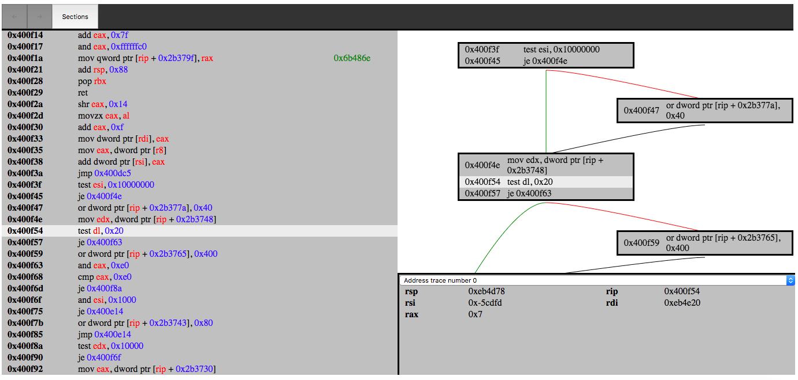

# Triforce

(web interface, click for better resolution)

# 	status
There is now a branch called version 0.1, it shows the idea and part of the vision. Master is maybe already version 0.2, it's web component is a lot faster than the previous version(still some left to do). However, I want more work done on the emulator before I do a version bump. I feel I had a bit too much focus on the web interface for version 0.1. Now a big focus will be on extending the dynamic side, this is key for making this software good. That is why I have made a gdb like interface for the terminal, features will come to the terminal before the web interface to make design iterations faster.

#   Note
Mostly tested on CTF (elf)binaries + some glibc binary, I'm sure you can make the program do weird things if you try it on something big and complicated. *This program is still under construction*.

#	Features
-	flat view (see all the sections with code)
-	code grapth (click in a section, view the branches of the block)
-	~˙hex view (click an instruction see where it is in the binary)~ (currently disabled)
-	dynamic view (click an instruction, see what the values have been when that instruction was executed)
-	when you click a jump instruction, it moves you to the target. The jump target was not interesting? Move back with the back arrow at the menu. (will add keyboard shortcut, _ctrl + b_ maybe )
-	move around with arrow keys. Are you in graph view ? Use left and right arrow to select target block (if you are at a conditional block, if not press down). When you move between blocks a call stack will be made so you can easily move backwards.

# Design philosophy
What do you expect from a reverse engineering tool? You want quick insight into a program. How do you get insight? The best way is to get static data with the aid of dynamic information. The dynamic data show you where you have been, the static can help you get where you want to be. If the binary has been obfuscated the dynamic part will guide the static part. You want to be able to move around in the program flawlessly. This tool will have focus on speed, you want to do things like root cause analysis fast and this tool should work fast in environments like CTFs. 

#  Status with unicorn (dynamic side)
Finally got a static binary with glibc to run from start to finish! I will continue to improve the emulator, still many syscalls and other funconality to implement, the future is bright. However, first I want to take some time to better integrate the emulator into the software before extending it's functionality. Like doing some root cause analysis on the debugging hooks to figure if and how to remove them and improve things like memory mapping and the stack handler for the emulator.

#  Do I think I can make a better tool than IDA? 
It's not about that. I started this project to hopefully see some changes in reverse engineering landscape. Things have been still there for a while and competition is needed to bring on changes with impact. I think this is competing against QIRA though.

#	Work in progress / ideas
-	unicorn support
	-	see what each instruction has done to the memory and other registers
		-	basically like gdb break on every instruction
	-	rewind, go to the previous state just by moving the arrow keys(like QIRA)...
	-	only see where you have been in a binary with dynamic code grapths!
	-	custom strace! Since I have to code all the syscalls, I can eaisly monitor them! Monitoring syscalls should make finding bugs like use after free easier!
		-	will write support for this in the db soon.
	
-	**integrate dwarf data**
	-	you don't need a decompiler when you have dwarf!
		-	I migth try to write parts of a decompiler, would be fun!
-	make it easy to store comments and patches made to the binary. 
-	binary patching
	-	I have coded parts of this already, however it needs a better interface
-	visualizing a binary
	-	see the entropy
	-	regions with text/data etc
	-	not sure if I will integrate this into the main interface. I don't want things to get bloated

#   What is the plan?
static and dynamic reverse engineering, one package with a seamless interface. 

(from http://www.keystone-engine.org/docs/BHUSA2016-keystone.pdf )

# setup and run
This program is still under construction, the install can be unstable.

### setup general
>  pip3 install -r requirements.txt
- install capstone from the next branch + python binding
		https://github.com/aquynh/capstone/tree/next
- install keystone + python binding
		https://github.com/keystone-engine/keystone
- install unicorn + python binding
		https://github.com/unicorn-engine/unicorn

### setup linux
>	./install.sh

### setup docker
> 	docker build --tag=triforce .

### run 
> 	python3 main.py ./test_binaries/fibonacci

> 	docker run -p 4000:80 triforce ./test_binaries/fibonacci

