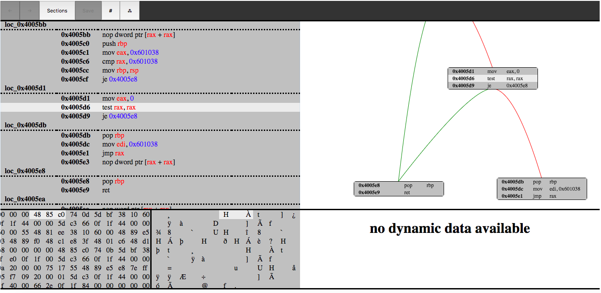

# Triforce

#   Notes
Mostly tested on some CTF (elf)binaries, I'm sure you can make the program do weird things if you try it on something big and complicated. *This program is still under construction*.

#	Features
-	flat view (see all the sections with code)
-	code grapth (click in a section, view the branches of the block)
-	hex view (click an instruction see where it is in the binary)
-	(work in progress) dynamic view (click an instruction, see what the values have been when that instruction was executed)
-	when you click a jump instruction, it moves you to the target. The jump target was not interesting? Move back with the back arrow at the menu. (will add keyboard shortcut, _ctrl + b_ maybe )
-	move around with arrow keys. Are you in graph view ? Use left and right arrow to select target block (if you are at a conditional block, if not press down). When you move between blocks a call stack will be made so you can easily move backwards.

# Design philosophy
What do you expect from a reverse engineering tool? You want quick insight into a program. How do you get insight? The best way is to get dynamic data with the aid of static information. The dynamic data show you where you have been, the static can help you get where you want to be. If the binary has been obfuscated the dynamic part will guide the static part. You want to be able to move around in the program flawlessly. This tool will have focus on speed, you want to do things like root cause analysis fast, this tool should work fast in environments like CTFs. 

#  Status with unicorn (dynamic side)
Currently I am running gdb and unicorn side by side on some static binaries, trying to get unicorn to run through the entire program flawlessly. Seems like special instructions like cpuid and xgetbv ~~and instructions that affect the eflags~~ give different results from gdb ... ~~Also as far as I know, implementing system specific system calls also has to be done~~ (written support for two syscalls, you can now run hello world). The debugger I wrote for unicorn does help (a lot) with root cause analysis, so I hope to see some meaningful progress soon. 

Update : Even though I looked at the disassembly for \_dl_aux_init for way to long, it didn't occur to me that I forgot to implement a way to push the aux_vector onto the stack. I created decoding_the_stack.txt where I do some rubber duck debugging, not all progress is realated to actual code!

Update 2 : Made a lot of progress recently. Implemented more syscalls and fixed the aux vector (so I passed through \_dl_aux_init). Special instructions slows me down again. Unicorn reports wrong size/does something weird with these instructions vmovdqu/vpbroadcastb/vmovd so I have opened a Unicorn issue and currently reading Qemu source code. https://github.com/unicorn-engine/unicorn/issues/1088 given that keystone and unicorn disagrees, I hope I did nothing wrong... 

Update 2.1: I did nothing wrong, there was a bug, but I was running a outdated version that I thought was updated(because of a version conflict with pip)...

**Update 3: wohoo, finally got a static binary with glibc to run from start to finish! I will continue to improve the emulator, still many syscalls and other funconality to implement, the future is bright. However, first I want to take some time to better integrate the emulator into the software before extending it's functionality. Like doing some root cause analysis on the debugging hooks to figure if and how to remove them and improve things like memory mapping and the stack handler for the emulator.**

#  Do I think I can make a better tool than IDA? 
It's not about that. I started this project to hopefully see some changes in reverse engineering landscape. Things have been still there for a while and competition is needed to bring on changes with impact. I think this is competing against QIRA though.

#	Work in progress / ideas
-	unicorn support
	-	see what each instruction has done to the memory and other registers
		-	basically like gdb break on every instruction
	-	rewind, go to the previous state just by moving the arrow keys(like QIRA)...
	-	only see where you have been in a binary with dynamic code grapths!
	-	custom strace! Since I have to code all the syscalls, I can eaisly monitor them! Monitoring syscalls could(should?) make finding bugs like use after free easier!
	
-	**integrate dwarf data**
	-	you don't need a decompiler when you have dwarf!
		-	I migth try to write parts of a decompiler, would be fun!
-	make it easy to store comments and patches made to the binary. 
-	binary patching
	-	I have coded parts of this already, however it needs a better interface
-	visualizing a binary
	-	see the entropy
	-	regions with text/data etc
	-	not sure if I will integrate this into the main interface. I don't want things to get bloated

#   What is the plan?
static and dynamic reverse engineering, one package with a seamless interface. 

(from http://www.keystone-engine.org/docs/BHUSA2016-keystone.pdf )

# setup general
>  pip3 install -r requirements.txt
- install capstone from the next branch + python binding
		https://github.com/aquynh/capstone/tree/next
- install keystone + python binding
		https://github.com/keystone-engine/keystone
- install unicorn + python binding
		https://github.com/unicorn-engine/unicorn

>	python3 web.py ./test_binaries/fibonacci

# setup linux
>	./install.sh

# setup docker
> 	docker build --tag=triforce .

# run 
> 	python3 web.py ./test_binaries/fibonacci

> 	docker run -p 4000:80 triforce ./test_binaries/fibonacci

